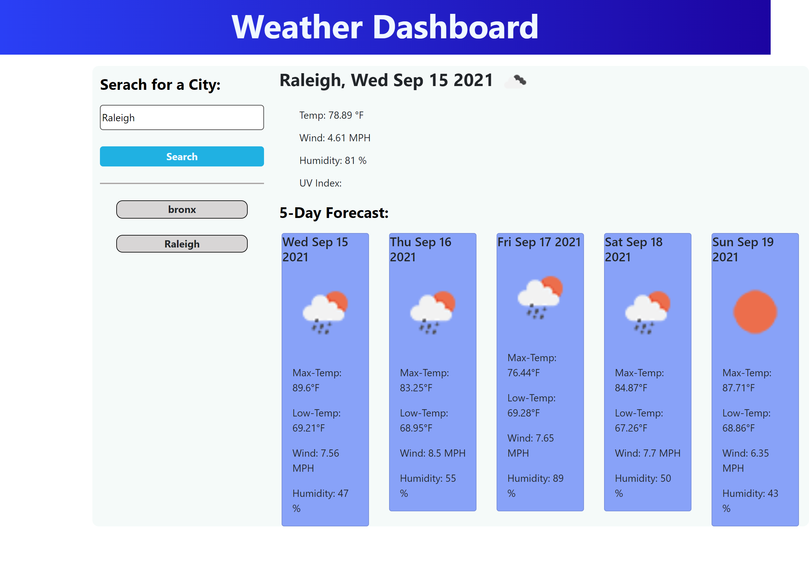

# API Weather Dashboard

## The weather dashbord allows users to retrieve the current weather for the location that they enter and provides a five-day forcast. In addition to the current temperature, the app also provides several additional data points, including wind and humidity.

## Users will need to enter the city location, and or, city and state. Additionally, prior searches will be saved on the left side of the page and users can simply click on their previous search location to retrieve the weather data.

# images

